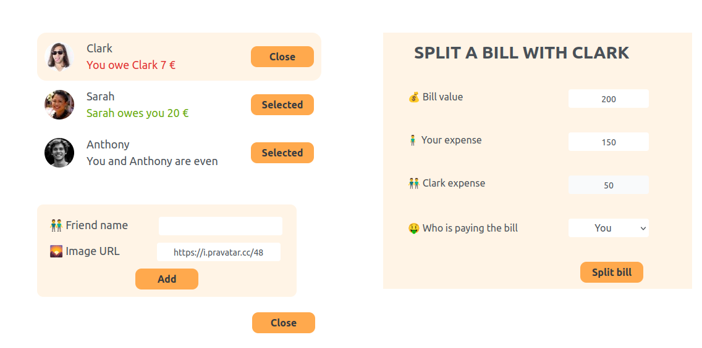

# Eat and Split

The Eat and Split app is a simple, user-friendly application designed to help users calculate and split restaurant bills among friends. With an intuitive interface, users can easily input their meal costs and the number of people sharing the bill.

## Features

- Input the total bill amount.
- Specify how many people will share the bill.
- Calculate the amount each person needs to pay.
- Option to include tip percentage for more accurate calculations.
- Clear and responsive layout.

## 🛠️ Tech Stack

| Technology | Description |
|------------|-------------|
| React.js | For building the user interface |
| JavaScript | To handle calculations and interactivity | 
| HTML5 | Structure and semantic markup |
| TailwindCSS | Utility-first CSS framework for styling |

## Getting Started

1. Clone the repository to your local machine:
   ```bash
   git clone https://github.com/Briso10-dev/Eat-n-split

2. Navigate to the project directory:
   ´´´bash
   cd Eat-n-split

3. Install the required dependencies:
    ´´´bash
    npm install

4. Start the development server:
    ´´´bash
    npm start

Project Structure

    src/: Contains all the React components and logic.
    public/: Contains the HTML file and any static assets.

## 📸 Screenshots



## 🙏 Acknowledgments

- Thanks to all contributors who helped in building this project
- Inspiration from modern e-commerce platforms
- Tailwind CSS community for the excellent documentation

## 👥 Authors

- [@Briso-dev](https://github.com/Briso10-dev) - Frontend Development

## 📄 License

This project is open source and available under the [MIT License](LICENSE).